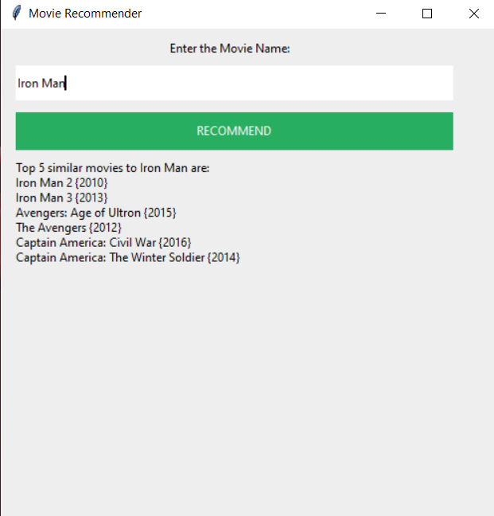

# The-Ultimate-listmaker
In these the user will need to insert one movie that they like and in return they will get a list of 5 movies which the user will like to watch.
</h1>There is only one constraint in these Program that the user must enter the movie name according to its release name.</h1>
  

  

